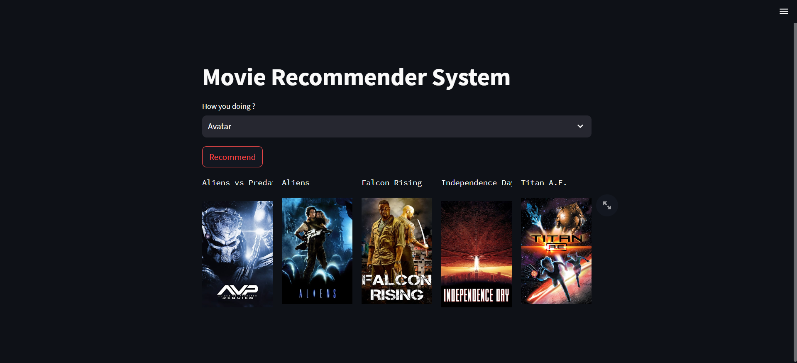
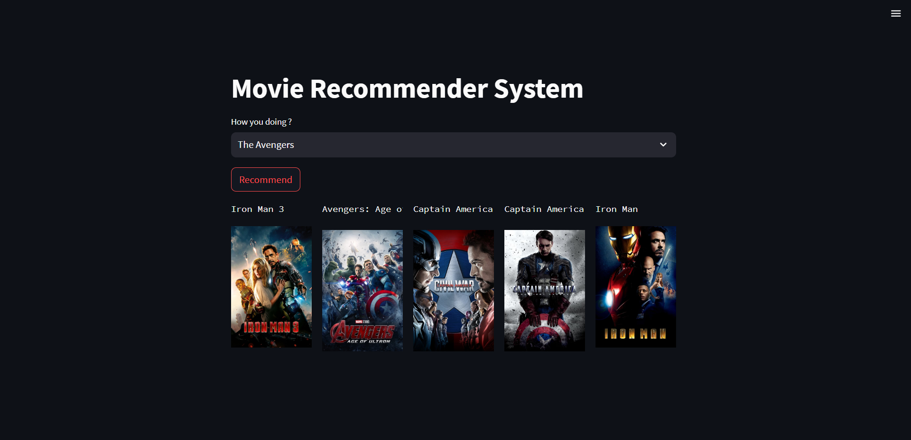

# Movie Recommendation System

This project is a movie recommendation system based on content filtering, which uses Cosine Similarity to recommend movies to users based on their preferences. The dataset used for this project is the TMDB 5000 Movies Dataset, which contains information about over 5,000 movies.

## Data

The TMDB 5000 Movies Dataset can be downloaded from [Kaggle](https://www.kaggle.com/tmdb/tmdb-movie-metadata). After downloading the dataset, extract the `movies_metadata.csv` and `credits.csv` files and place them in the `data` directory of the cloned repository.

## Dependencies

The following Python libraries are required to run the code in this repository:
- numpy
- pandas
- sklearn
- nltk

## Some ScreenShot

## Usage

1. Clone the repository using the following command:
git clone https://github.com/Jyotsan-Hamal/ML-projects/Movie-Recommendation-System.git

2. Download the TMDB 5000 Movies Dataset from the link provided above and extract the `movies_metadata.csv` and `credits.csv` files. Place these files in the `data` directory of the cloned repository.

3. Open the `movie-recommendation-system.ipynb` notebook using Jupyter Notebook or any other compatible environment.

4. Run the code cells in the notebook to train the movie recommendation system. The cosine similarity vector will be saved in a file named `similar.pkl`.

